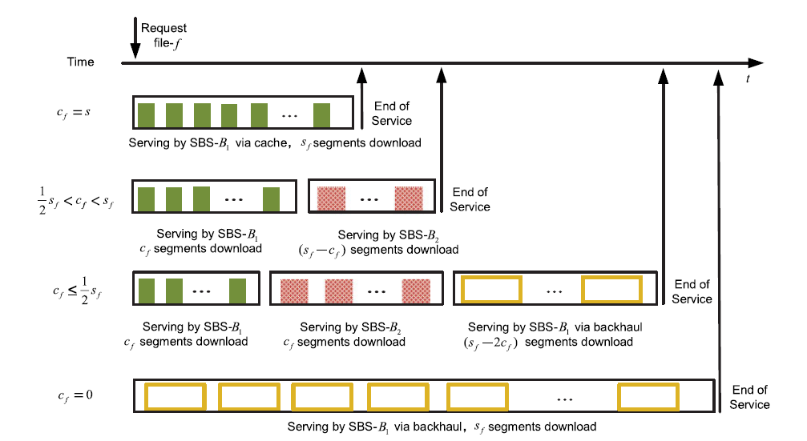

# Organize

I.

*`Delay Analysis and Optimization in Cache-enabled`*  : 
 
  &emsp;system model 跟學長那篇有點像，但是average delay的公式是利用 queueing theory的M/M/1推的， 接著要去最佳化公式，也是跟學長一樣先去證明是NP-complete，然後再去找驗算法。 
  &emsp;作者找演算法的流程是將優化問題表示為受擬陣(matroid)約束的非遞減子模函數的最大化，從而使我們能夠採用具有1/2近似性能保證的低複雜度貪婪緩存算法。然後提出了一種啟發式貪婪演算法(Heuristic greedy algorithm)，該方案不僅考慮內容的受歡迎程度，存儲容量和用戶請求到達率，還考慮內容的大小。------>但是這段證明我實在看不懂，需要蠻多先備知識的。

  

II.

*`Content-Exchanged Based Cooperative Caching in 5G Wireless Networks`* : 
   &emsp;( 03/16 meeting 內容 )

III.

*`Cooperative Edge Caching in User-Centric Clustered Mobile Networks`* :  

  &emsp;學長論文內所比較的 Zhang's scheme  
  其實我有點不是很懂學長的方法為何會比較快，因為這篇論文也是有用到cluster的想法，而且還不需要用到backhaul傳遞。 應該是我還沒理解此篇論文是如何套進學長的system內的。

       

    
  &emsp; 後來想了一下，我想此論文的 cluster 是把一群 user 變成一組 group (如上圖，以sbs-2的角度來看，他會把 user-1 & user-5 看成一組 group，因為距離這兩位 user 第二近的 sbs 就是 sbs-2 )，然後再去對每個 SBS 的不同   group 做 wireless bandwidth ratio 的最佳化。 
  &emsp; 然而學長的論文因為不討論頻寬，所以如果套進學長的 system 的話，直接省略最佳化頻寬的步驟，再者學長因為有 backhaul 連接其他 sbs 成為 cluster (利用 backhaul 去其他 sbs 抓取資料，再利用最近的 sbs 傳送到 user )，所以此篇論文就相對會比較慢，因為距離 user 越遠的 sbs 傳送資料到 user 的 delay 會越大。
 
 

IV.

1 ) *`Cooperative Caching and Transmission Design in Cluster-Centric Small Cell Networks`* : 
2 ) *`Cluster-centric cache utilization design in cooperative small cell networks`* : 

&emsp;( 用來了解 Cluster-Centric  與 User-Centric的差異 : 作者用 Cluster-Centric 是為了分析方便)  

&emsp;為了平衡傳輸和內容多樣性，作者提出了一種以緩存為中心的策略，結合緩存和傳輸策略的設計。cluster中的整個緩存空間由中央控制器安排，以便在每個SBS中分發相同的最流行內容，或在不同的SBS中存儲較不受歡迎的內容的不同分區(MPC & LCD)，從而確保可以在cluster內部找到所有緩存的內容。 
&emsp;根據所請求內容的可用性和位置，具有聯合傳輸或併行傳輸的協作多點技術(CoMP)用於將內容交付給服務的用戶。

       

<!-- V. *``* :    -->

# My Proposal
&emsp;一開始我是覺得學長的 cluster 機制可能沒有說 make sence ，因為我原本以為現實生活中每個 sbs 不一定都會相連，且學長的 sbs 相連的線還是串接的，又更讓我疑惑了，在經過老師的講解後，大約理解到那應該算是示意圖(而且 sbs 之間可以靠 x1 介面或是 x2 介面相連溝通的)，所以我只能再繼續從別處下手。 
&emsp;後來還是覺得可以從 cluster 去下手，學長 cluster 的機制是以 sbs 的編號組成 cluster ，但是這個地方是可以去討論的，因為現實生活中通常是在某個地區的同質性比較高，所以當地的 user 可能會重複求取某些相同的 contents (這些內容比較受歡迎)，但是學長的 system 是以編號組成 cluster ，有可能出現同一個 cluster 的 sbs 相距甚遠，這樣會出現同一個 cluster 內的 sbs caching 的 contents 是不太相似的，導致增加跟remote servers 要東西的次數，使平均傳輸時間增加。 
&emsp;&emsp;1)&emsp;能不能使鄰近的sbs成為一個 cluster ? 如此一來，平均傳輸時間會減少嗎?  
&emsp;&emsp;2)&emsp;如果以 [IV.](#IV.) 想法放進學長的 system 可行嗎? content placement 的策略要更改嗎? 如此一來，平均傳輸時間會減少嗎?   
&emsp;&emsp;3)   
&emsp;&emsp;4)   

# Reference
  [1]&emsp;Y. Sun, Z. Chen and H. Liu, "Delay Analysis and Optimization in Cache-Enabled Multi-Cell Cooperative Networks," 2016 IEEE Global Communications Conference (GLOBECOM), Washington, DC, 2016, pp. 1-7.

  [2]&emsp;Z. Chen, J. Lee, T. Q. S. Quek and M. Kountouris, "Cooperative Caching and Transmission Design in Cluster-Centric Small Cell Networks," in IEEE Transactions on Wireless Communications, vol. 16, no. 5, pp. 3401-3415, May 2017.

  [3]&emsp;S. Zhang, P. He, K. Suto, P. Yang, L. Zhao and X. Shen, "Cooperative Edge Caching in User-Centric Clustered Mobile Networks," in IEEE Transactions on Mobile Computing, vol. 17, no. 8, pp. 1791-1805, 1 Aug. 2018.